# 第 10 回講義の課題

## 課題内容

- これまでに構築した AWS リソースを CloudFormation で構築する。

## 使用したテンプレート

- [lecture10-network.yml](templates/lecture10-network.yml)（VPC / サブネット / IGW / ルートテーブル）
- [lecture10-security.yml](templates/lecture10-security.yml)（セキュリティグループ / IAM ロール / インスタンスプロファイル ）
- [lecture10-application.yml](templates/lecture10-application.yml)（EC2 / ALB 関連 / RDS / S3）
- [lecture10-database.yml](templates/lecture10-database.yml)（RDS / サブネットグループ / シークレット）

### スタック

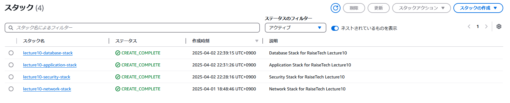

## テンプレートによって作成されたリソース

### VPC

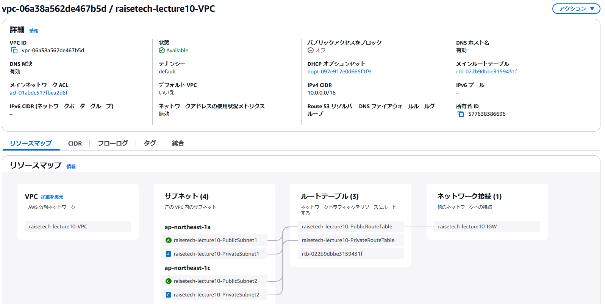

### インターネットゲートウェイ

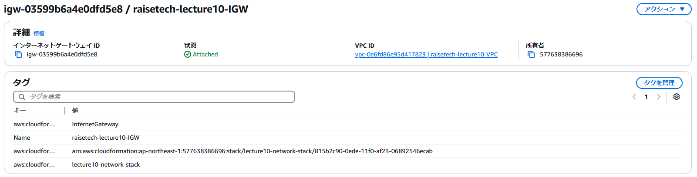

### デフォルトのパブリックルートテーブル設定

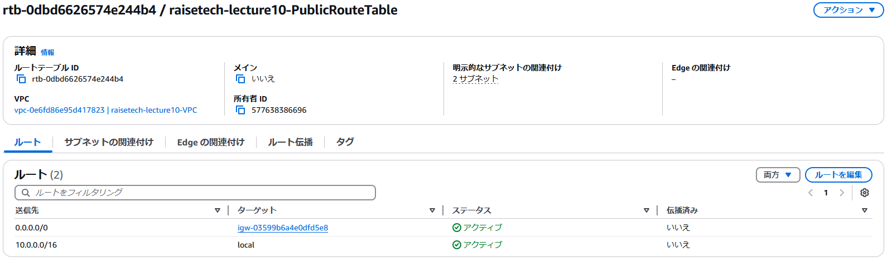

### EC2

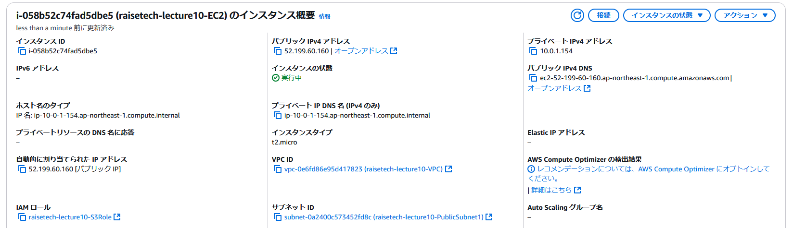

### EC2 のセキュリティグループ

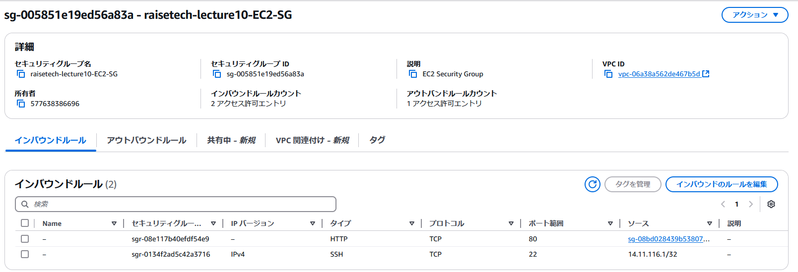

### RDS

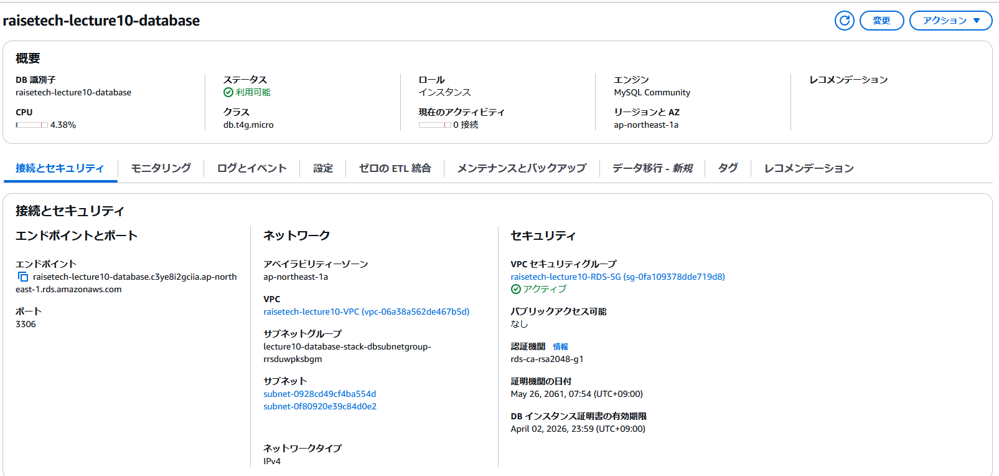

### RDS のセキュリティグループ

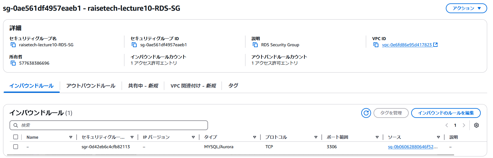

### DB のサブネットグループ

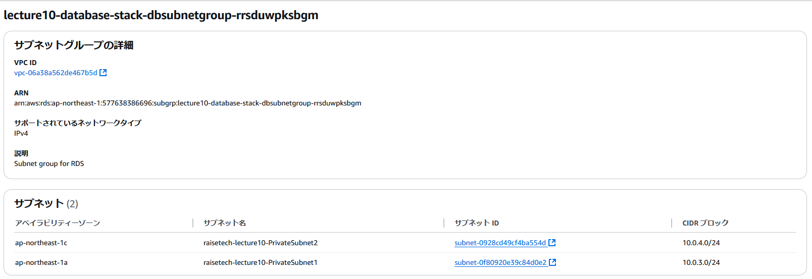

### ALB

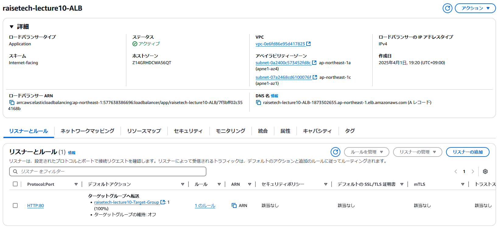

### ALB のセキュリティグループ

### ALB のターゲットグループ

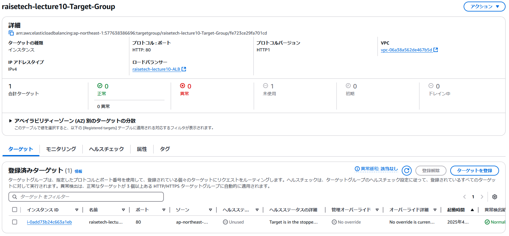

### S3 バケット

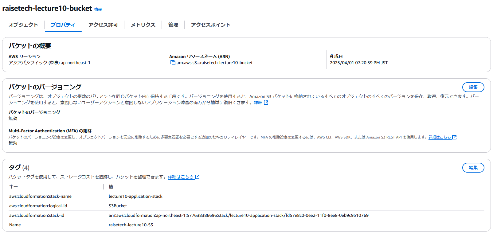

### S3 アクセスを許可するための IAM ロール

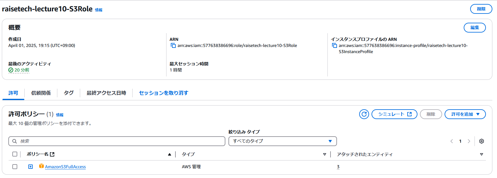

## 作成したリソースに接続する

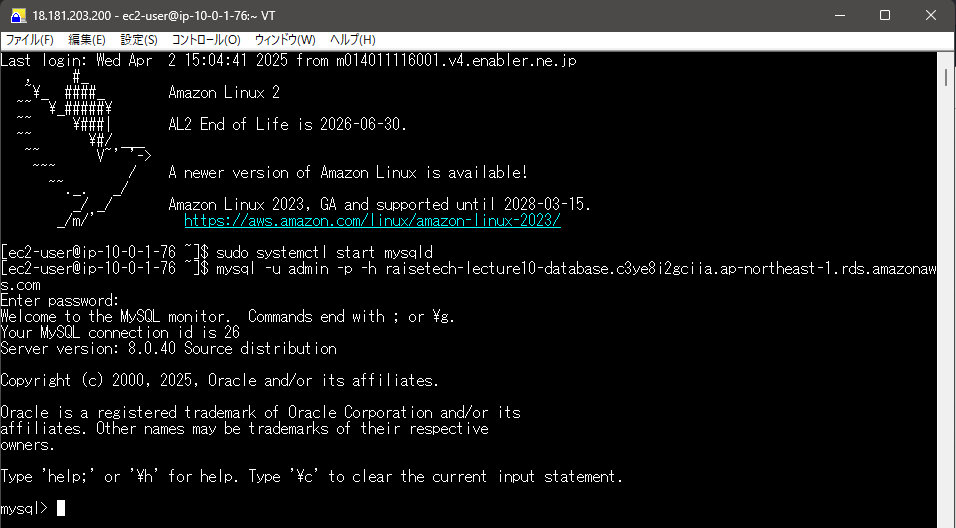

## 感想

- ロールバックされる仕組みのおかげで、何度もトライアンドエラーを繰り返すことが出来て、非常に学習が捗る良いシステムでした。
- `Outputs` でエクスポートした値を、別のスタックの組み込み関数 Fn::Sub の中で利用する手段がわからず困っていましたが、AWS 公式のドキュメントを参考にして解決することができました。ChatGPT を使っても解決策が返ってこなかったので勉強になりました。
- 第 6 回で学んだ AWS Secret Manger を使用しました。シークレットに値が保存されるので、別途パスワードをメモする必要もなく便利でした。
