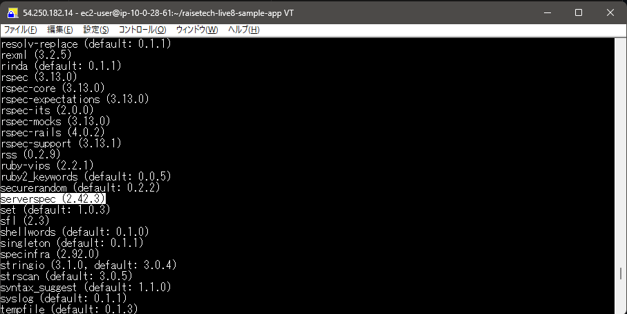
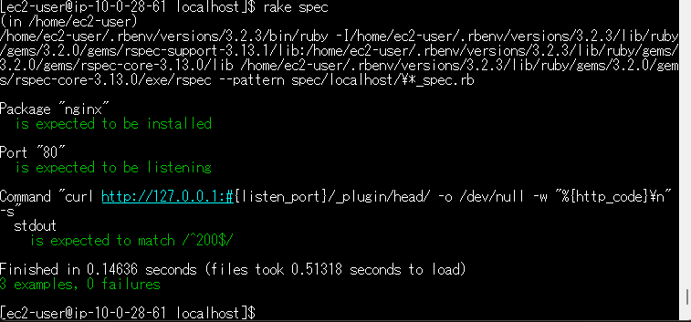
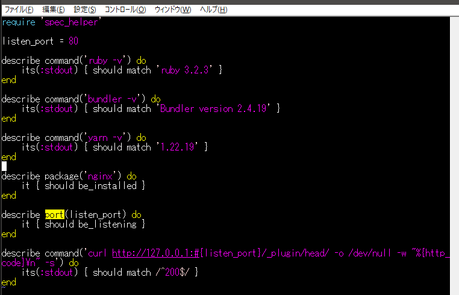
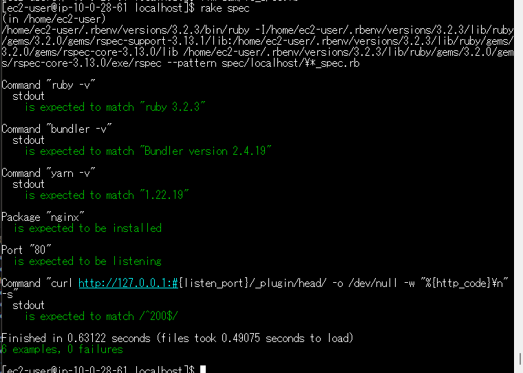
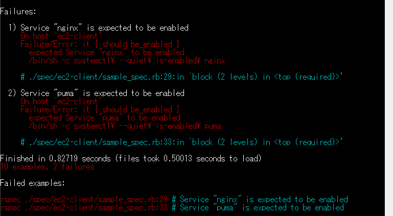
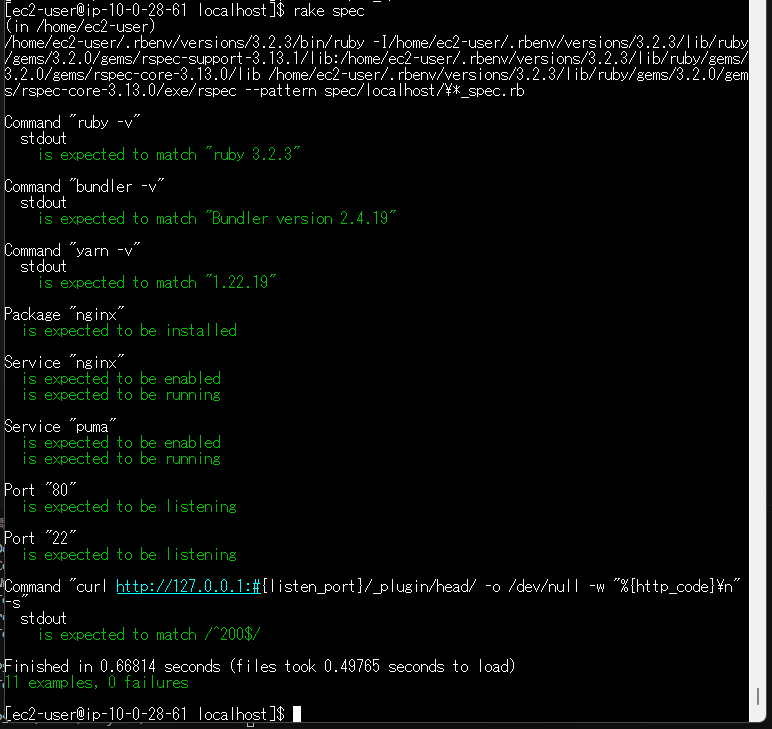

# 第 11 回講義の課題

## 概要

- 課題で作成した AWS 環境に対して、 Serverspec を使ったテストを実行する。
- 前提条件として、サンプルアプリケーションを起動してアクセスできる事を確認しておく。

### Serverspec のインストールとバージョン確認

```
$ gem install rake
$ gem install serverspec
$ gem list
$ serverspec-init # テストに必要なファイルを生成
```



### 1. まずは講義で配布されたサンプルをベースに実行確認

```
require 'spec_helper'

listen_port = 80

describe package('nginx') do
  it { should be_installed }
end

describe port(listen_port) do
  it { should be_listening }
end

describe command('curl http://127.0.0.1:#{listen_port}/_plugin/head/ -o /dev/null -w "%{http_code}\n" -s') do
  its(:stdout) { should match /^200$/ }
end
```

**下記コマンドで実行する。**

```
$ rake spec
```

**実行結果**



### 2. 次に、`ruby / bundler / yarn`のバージョン確認を追加



**下記のバージョンとマッチすれば成功。**

- ruby 3.2.3
- Bundler version 2.4.19
- yarn 1.22.19

**画像の通り成功している。**



### 3. さらに、`Nginx / Puma`の起動確認

- 使用したファイル：[sample_spec.rb](sample_spec.rb)

**エラー：実行は成功するが、以下の部分が失敗する。**


- システム起動時に自動起動が有効になっていないため、以下のコマンドで設定変更

```
$ systemctl is-enabled puma # 自動起動のステータス確認
$ sudo systemctl enable puma # Pumaの自動起動を有効化
$ sudo systemctl enable nginx # Nginxの自動起動を有効化
```

**再度実行して、成功を確認した。**



## 感想

- インターネットにある Serverspec の情報がものすごく古いものが多いうえに情報自体少なくて、なかなか実行コマンドが成功せず細かいエラー修正を繰り返したので、難しく感じました。
- また、どうやらコードの書き方が複数存在するらしい点も、正しい情報を拾いづらい要因となっていました。
- 一方で Serverspec を利用すれば 、1 つのファイルを実行するだけでまとめて動作環境を確認できるのは非常に便利に感じました。
