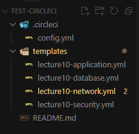
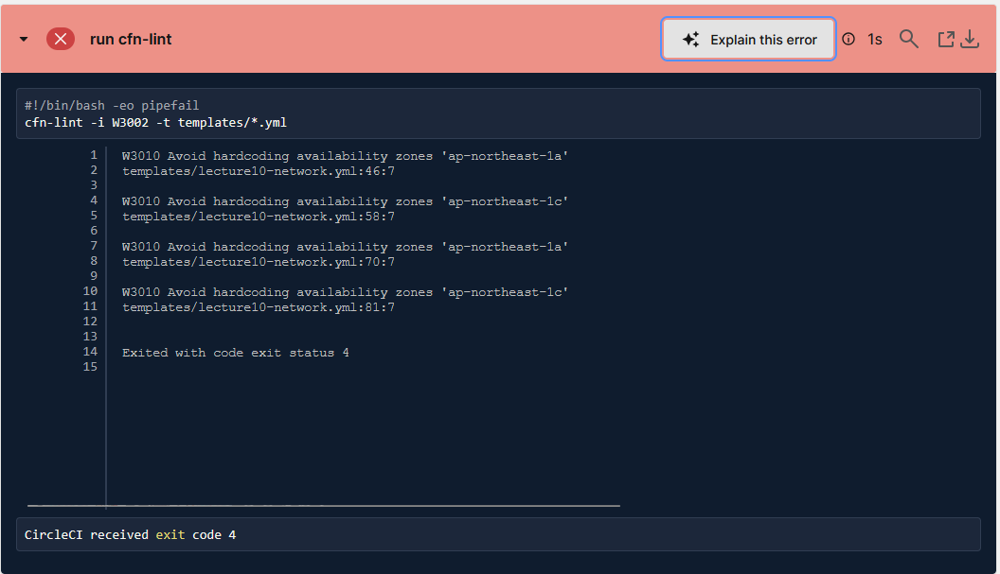
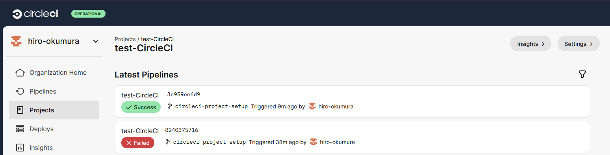
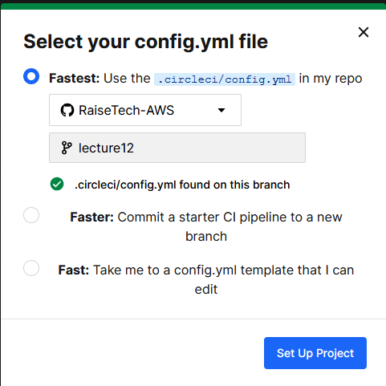
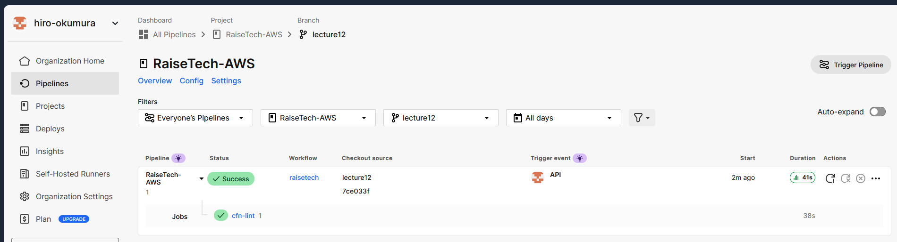
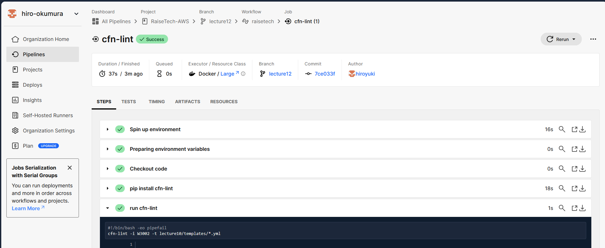

# 第 12 回課題の提出

## 概要

- CircleCI のサンプルコンフィグが動作するようにリポジトリに組み込む。
- cfn-lint を用いて CloudFormation の記述内容が正しく動作するか確認する。

## まずは `test-CircleCI` リポジトリを新規作成して試してみる

- CircleCI 側で新しくブランチを切って config.yml を作成


**config.yml を下記のように書き換える**

```
version: 2.1
orbs:
  python: circleci/python@2.0.3
jobs:
  cfn-lint:
    executor: python/default
    steps:
      - checkout
      - run: pip install cfn-lint
      - run:
          name: run cfn-lint
          command: |
            cfn-lint -i W3002 -t templates/*.yml
workflows:
raisetech:
jobs: - cfn-lint
```



**リモートにプッシュして CircleCI を確認する**

- 1 回目の実行ではエラーが発生。AZ の指定 をハードコーディングしていたため、` !Select [0, !GetAZs "ap-northeast-1"]`および`!Select [1, !GetAZs "ap-northeast-1"] `に記述を変更



**2 回目の実行で成功を確認した**



## このリポジトリに CircleCI を組み込む

- 今回は lecture12 ブランチに既に作成した`.circleci/config.yml`を利用する。



**実行結果を確認**

- テストで作成したリポジトリで 1 度試した甲斐もあり、そのままストレートで成功した。





## 感想・学んだこと

- AWS やコーディングについて学習中の身としては、単にコードが正しく動作するかどうかだけなく、推奨された書き方が出来ているかどうかもチェックされるのでとても助かるサービスでした。
- 講義で学んだ CI/CD ツールが持つ 3 つの機能（ジョブ機能、トリガー機能、パイプライン機能）が、config.yml のどこの部分に該当するのか学びながら課題を行ったので、これを第 13 回の課題に活かしたいと思います。
- 今回は CircleCI を使いましたが、Github Action も勢いのあるサービスだと聞いたので、課題が落ち着いたら触ってみたいと思いました。
